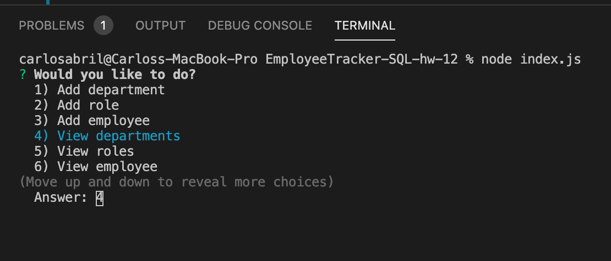

# EmployeeTracker-SQL-hw-12

## Table Of Content

    1. Description
    2. User Story
    3. Minimum Requirements
    4. Website Link
    5. Website Screenshot

## Description
For this week homework assignment, the task was to build a solution for managing a company's employees using node, inquirer, and MySQL. 



## User Story

```
As a business owner
I want to be able to view and manage the departments, roles, and employees in my company
So that I can organize and plan my business
```

## Minimum Requirements

* Functional application.

* GitHub repository with a unique name and a README describing the project.

* The command-line application should allow users to:

  * Add departments, roles, employees

  * View departments, roles, employees

  * Update employee roles


[Video link] (https://drive.google.com/file/d/1ICGktmk6L8JMXURv8mZbBW8Z5ktfYG2v/view)


